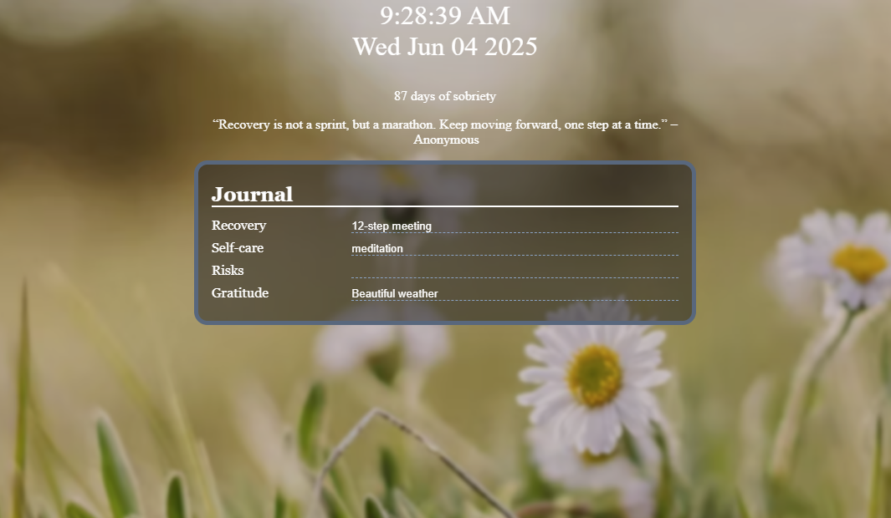
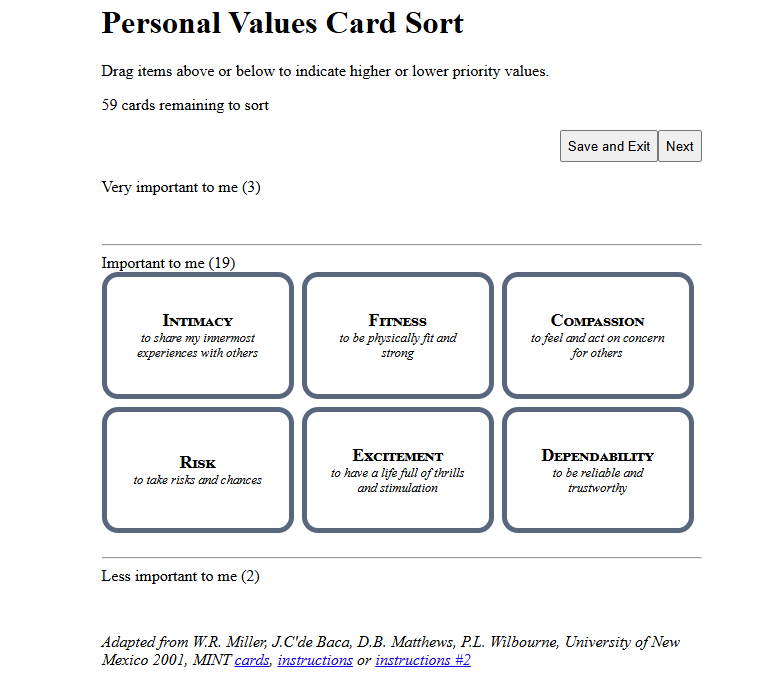

# Recovery Toolbox
Helpers for people in addiction recovery

## What is Recovery Toolbox?
Recovery Toolbox is a foundation for tools to help addicts with their recovery process. Currently consists of a page suitable as a new tab page for tracking sobriety and daily progress, along with a value card sorter tool to assist with finding meaning in your life.

### Journal

### Value Sorter

## Licensing
Recovery Toolbox is distributed under a version of the "MIT License",
which is a BSD-like license. See the 'LICENSE' file for details.

## Environment
Currently all static web pages using HTML application local storage with no backend.

## How to build
Not needed

## How to use
For the sobriety journal, open src/journal/index.html. Enter notes on how you worked your recovery, ways you engaged in self-care, risks to your sobriety, and things you're grateful for. Entries automatically save for the given day and will display until the next day.

For the valud card sorter tool, open src/values/index.html. Drag and drop values to Very or Less Important to me, then click Next. As this is still in-progress, there is nothing else to see for now.

## Todo
So much! I envision the journal being used as a new tab page and maybe creating an extension would make this easy. Overally, the code is extremely rough and mostly proof of concept. Sorry!

### Journal (src/journal)

- Rotate backgrounds
- Add affirmations
- Add entry for sobriety date (app storage, key=sobrietyDate, value = YYYY-MM-DD)
- Add navigation for previous journal entries (app storage, key=journal)

### Value Sorter (src/value-sorter)

- Better presentation (much in progress)
- Once all sorted, sort until only ten in More Important
- Once ten in More Important, maybe allow for granular ordering
- Printable view for final ten
- Display view for final ten
- Maybe use these highest values in journal (cycle under days of sobriety?)
